## Pre-requisitos
* 1. Instalacion Terraform :  https://developer.hashicorp.com/terraform/install 
* 2. Instalacion AWS CLI: https://docs.aws.amazon.com/cli/latest/userguide/getting-started-install.html

## Consideraciones
* 1. Comandos mostrados en Power Shell
* 2. La infraestructura AWS se ejecutara sobre REGION OREGON (us-west-2)

## Arquitectura

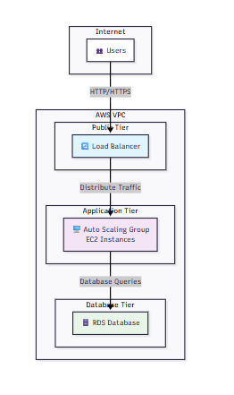


## Generar SSH

* Crear directorio para las keys si no existe
```
if (!(Test-Path "$env:USERPROFILE\.ssh")) {
    New-Item -ItemType Directory -Path "$env:USERPROFILE\.ssh"
}
```
* Generar par de llaves SSH
```
ssh-keygen -t rsa -b 2048 -f "$env:USERPROFILE\.ssh\terraform-lab" -N '""'
```

* Verificar que se crearon las llaves
```
Get-ChildItem "$env:USERPROFILE\.ssh\terraform-lab*"
```

## Actualizar la ruta de la llave publica

* Ir al archivo main.tf principal y actualizar la linea 72, con la ruta absoluta donde se generero llave SHH (terraform-lab.pub) 

Ejemplo: 
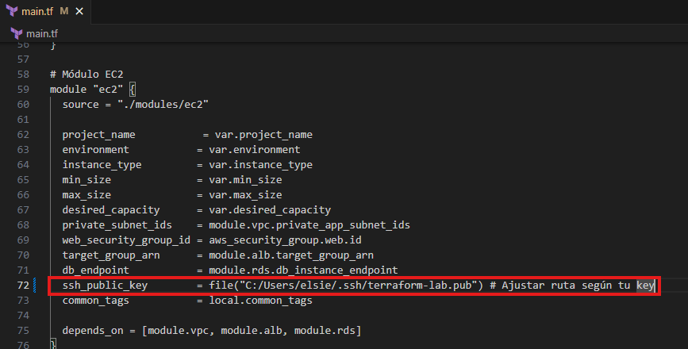


## Inicializar Terrraform

Nota: Ubicarse en el directorio raiz del proyecto (\lab-terraform)

* Inicializar Terraform (descargar providers)
```
terraform init
```

Ejemplo: 
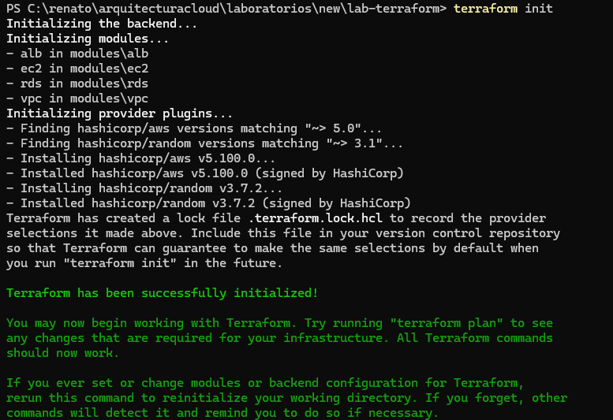


* Verificar la inicialización
```
terraform version
```

Ejemplo: 
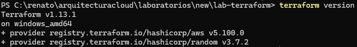


## Validar Configuracion

* Validar sintaxis de los archivos .tf
```
terraform validate
```

Ejemplo: 
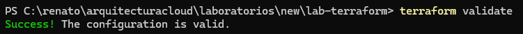


* Formatear código (opcional pero recomendado)
```
terraform fmt
```

Ejemplo: 
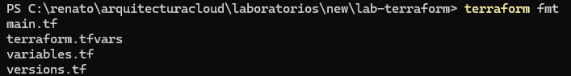


* Revisar el plan de ejecución
```
terraform plan
```

Ejemplo: 
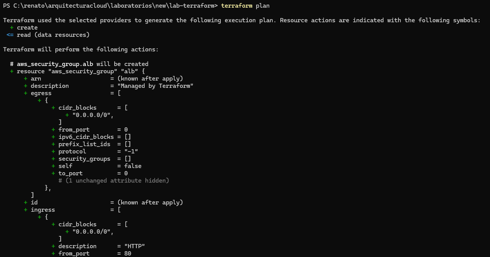


## Crear Infraestructura

* Aplicar la configuración (crear recursos)
```
terraform apply
```

Ejemplo: 
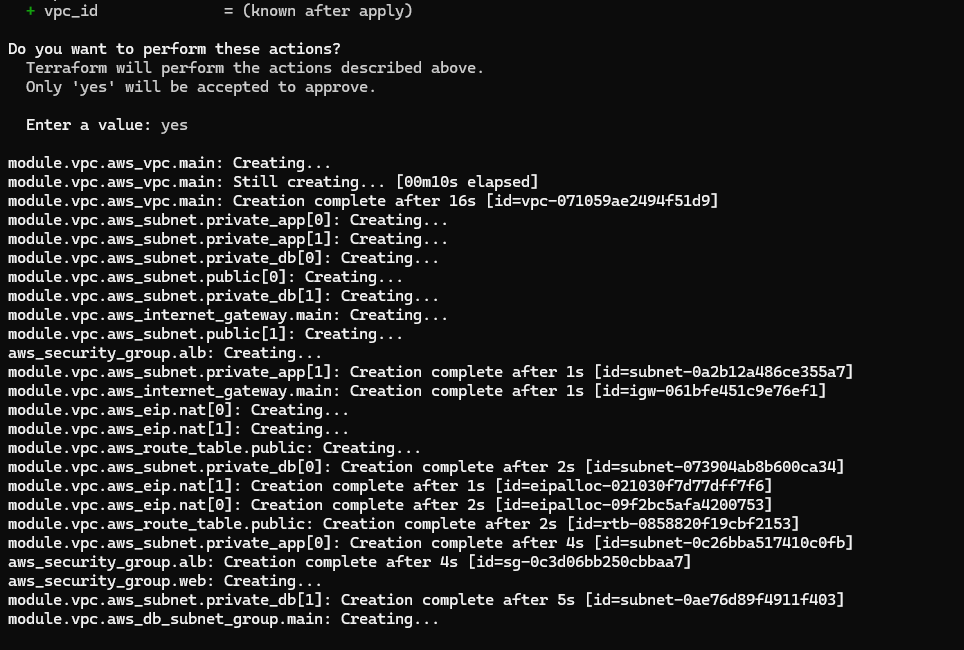


* Confirmar con 'yes' cuando se solicite o usar auto-approve (solo para labs - Opcional)
```
terraform apply -auto-approve
```

## Verificar Despliegue

* Mostrar los outputs definidos
```
terraform output
```

Ejemplo: 
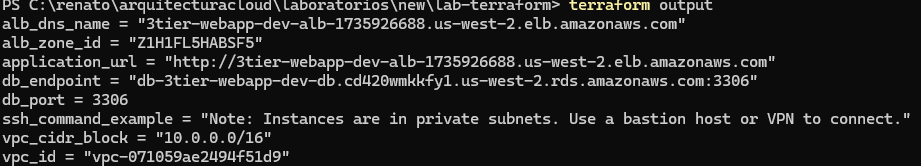


* Obtener la IP del Load Balancer
```
$ALB_DNS = terraform output -raw alb_dns_name
Write-Host "Load Balancer DNS: $ALB_DNS"
```
* Verificar el estado de los recursos
```
terraform state list
terraform show
```

## Probar la Aplicacion

* Invocar la URL del Load Balancer en el navegador

http://3tier-webapp-dev-alb-1735926688.us-west-2.elb.amazonaws.com

Ejemplo: 
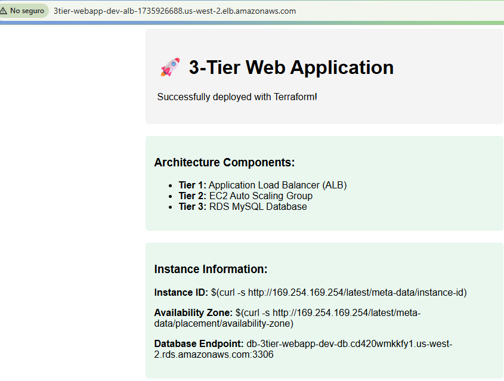


## Limpieza de recursos

* Revisar qué se va a eliminar
```
terraform plan -destroy
```

* Eliminar todos los recursos
```
terraform destroy
```

Ejemplo: 
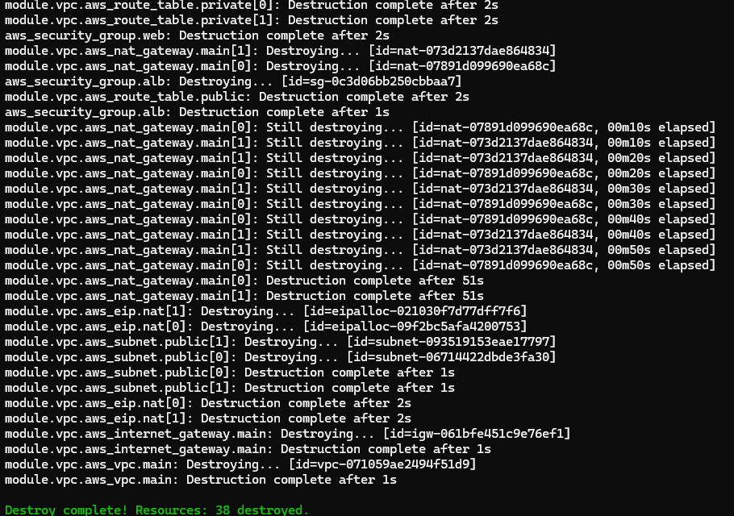


